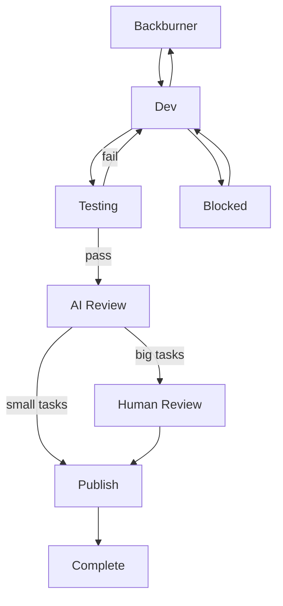

# Kanban Synchronization Protocol - Part 2: Label Transitions and Board Commands

This document contains the valid label transitions and project board synchronization commands.

**Parent document:** [KANBAN_SYNC_PROTOCOL.md](./KANBAN_SYNC_PROTOCOL.md)

---

## Label Transitions

### Valid Transitions



### Transition Commands

#### Backburner → Dev
```bash
gh issue edit {{ISSUE_NUMBER}} \
  --repo {{GITHUB_OWNER}}/{{REPO_NAME}} \
  --remove-label "status:backburner" \
  --add-label "status:dev"
```

#### Dev → Testing (moved by the ASSIGNEE, after PR is created)
```bash
gh issue edit {{ISSUE_NUMBER}} \
  --repo {{GITHUB_OWNER}}/{{REPO_NAME}} \
  --remove-label "status:dev" \
  --add-label "status:testing"
```

#### Testing → AI Review (moved by the TEST RUNNER, on pass)
```bash
gh issue edit {{ISSUE_NUMBER}} \
  --repo {{GITHUB_OWNER}}/{{REPO_NAME}} \
  --remove-label "status:testing" \
  --add-label "status:ai_review"
```

#### Testing → Dev (moved by the TEST RUNNER, on fail)
```bash
gh issue edit {{ISSUE_NUMBER}} \
  --repo {{GITHUB_OWNER}}/{{REPO_NAME}} \
  --remove-label "status:testing" \
  --add-label "status:dev"
```

#### AI Review → Human Review (big tasks requiring human approval)
```bash
gh issue edit {{ISSUE_NUMBER}} \
  --repo {{GITHUB_OWNER}}/{{REPO_NAME}} \
  --remove-label "status:ai_review" \
  --add-label "status:human_review"
```

#### AI Review → Publish (small tasks that pass AI review; mirror of the reviewer's verdict — the assignee never originates this move)
```bash
gh issue edit {{ISSUE_NUMBER}} \
  --repo {{GITHUB_OWNER}}/{{REPO_NAME}} \
  --remove-label "status:ai_review" \
  --add-label "status:publish"
```

#### Human Review → Publish (human-approved tasks; mirror of the reviewer's verdict)
```bash
gh issue edit {{ISSUE_NUMBER}} \
  --repo {{GITHUB_OWNER}}/{{REPO_NAME}} \
  --remove-label "status:human_review" \
  --add-label "status:publish"
```

#### Human Review → Dev (changes requested by human reviewer)
```bash
gh issue edit {{ISSUE_NUMBER}} \
  --repo {{GITHUB_OWNER}}/{{REPO_NAME}} \
  --remove-label "status:human_review" \
  --add-label "status:dev"
```

#### AI Review → Dev (changes requested by AI reviewer)
```bash
gh issue edit {{ISSUE_NUMBER}} \
  --repo {{GITHUB_OWNER}}/{{REPO_NAME}} \
  --remove-label "status:ai_review" \
  --add-label "status:dev"
```

#### Publish → Complete (mirror of the reviewer's verdict — the assignee never originates this move)
```bash
gh issue edit {{ISSUE_NUMBER}} \
  --repo {{GITHUB_OWNER}}/{{REPO_NAME}} \
  --remove-label "status:publish" \
  --add-label "status:complete"
```

#### Dev → Blocked
```bash
gh issue edit {{ISSUE_NUMBER}} \
  --repo {{GITHUB_OWNER}}/{{REPO_NAME}} \
  --remove-label "status:dev" \
  --add-label "status:blocked"
```

#### Blocked → Dev
```bash
gh issue edit {{ISSUE_NUMBER}} \
  --repo {{GITHUB_OWNER}}/{{REPO_NAME}} \
  --remove-label "status:blocked" \
  --add-label "status:dev"
```

#### Dev → Backburner (de-assignment)
```bash
gh issue edit {{ISSUE_NUMBER}} \
  --repo {{GITHUB_OWNER}}/{{REPO_NAME}} \
  --remove-label "status:dev" \
  --add-label "status:backburner" \
  --remove-assignee "{{AGENT_ASSIGNEE}}"
```

---

## Project Board Sync Commands

### Get Item ID for Issue

```bash
# Get project item ID from issue number
gh project item-list {{PROJECT_NUMBER}} \
  --owner {{GITHUB_OWNER}} \
  --format json | \
  jq -r ".items[] | select(.content.number == {{ISSUE_NUMBER}}) | .id"
```

### Update Status Field

```bash
# Get status field ID
STATUS_FIELD_ID=$(gh project field-list {{PROJECT_NUMBER}} \
  --owner {{GITHUB_OWNER}} \
  --format json | \
  jq -r '.[] | select(.name == "Status") | .id')

# Update item status
gh project item-edit \
  --project-id {{PROJECT_ID}} \
  --id {{ITEM_ID}} \
  --field-id "$STATUS_FIELD_ID" \
  --value "{{NEW_STATUS}}"
```

### Update Platform Field

```bash
# Get platform field ID
PLATFORM_FIELD_ID=$(gh project field-list {{PROJECT_NUMBER}} \
  --owner {{GITHUB_OWNER}} \
  --format json | \
  jq -r '.[] | select(.name == "Platform") | .id')

# Update item platform
gh project item-edit \
  --project-id {{PROJECT_ID}} \
  --id {{ITEM_ID}} \
  --field-id "$PLATFORM_FIELD_ID" \
  --value "{{PLATFORM}}"
```

### Update Priority Field

```bash
# Get priority field ID
PRIORITY_FIELD_ID=$(gh project field-list {{PROJECT_NUMBER}} \
  --owner {{GITHUB_OWNER}} \
  --format json | \
  jq -r '.[] | select(.name == "Priority") | .id')

# Update item priority
gh project item-edit \
  --project-id {{PROJECT_ID}} \
  --id {{ITEM_ID}} \
  --field-id "$PRIORITY_FIELD_ID" \
  --value "{{PRIORITY}}"
```

### Update Agent Field

```bash
# Get agent field ID
AGENT_FIELD_ID=$(gh project field-list {{PROJECT_NUMBER}} \
  --owner {{GITHUB_OWNER}} \
  --format json | \
  jq -r '.[] | select(.name == "Agent") | .id')

# Update item agent
gh project item-edit \
  --project-id {{PROJECT_ID}} \
  --id {{ITEM_ID}} \
  --field-id "$AGENT_FIELD_ID" \
  --text "{{AGENT_NAME}}"
```
